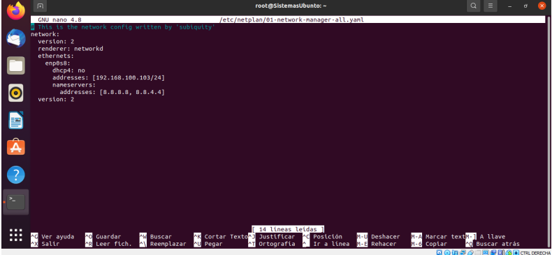
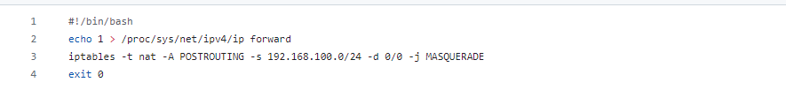

i### Network Configuration File in Ubuntu Server 
###### /etc/netplan/01-network-manager-all.yaml

#### After making the changes, save the file and apply the configuration with:
###### sudo netplan apply
#### Automatic Routing on Ubuntu Server:
###### Configure the server as a router to connect to other client machines. Set up the router to start automatically after BOOTING the machine.
#### Grant permissions to the SCRIPT with the command: 
###### chmod +x

## _To learn more about Netplan configuration on Ubuntu 22.04_: 
### https://linuxconfig.org/netplan-network-configuration-tutorial-for-beginners

## _To learn more about Iptables-rules:   
### https://help.ubuntu.com/community/IptablesHowTo

